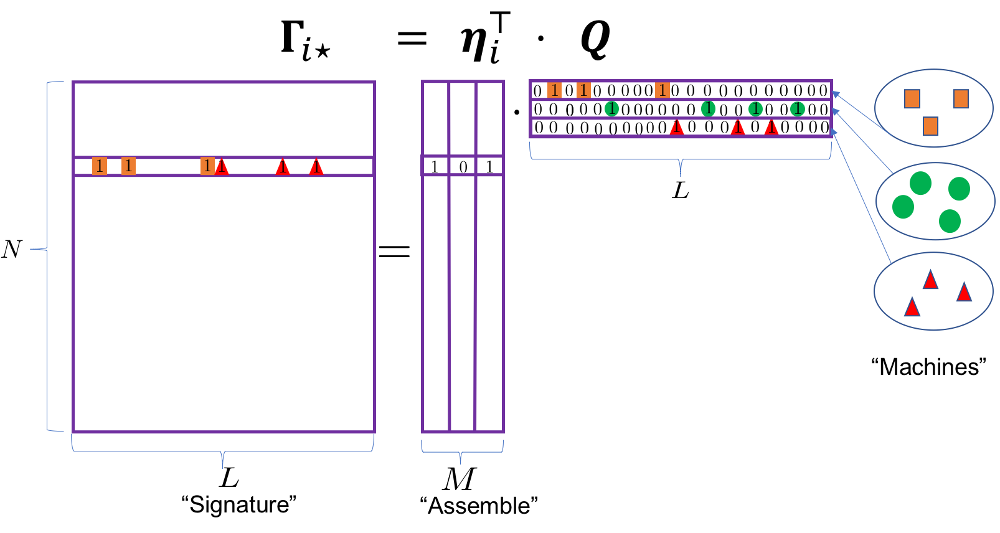

**rewind**: **R**econstructing **E**tiology **w**ith B**in**ary **D**ecomposition

An R package for fitting Bayesian restricted latent class models. 

zhenkewu badges:
[](https://travis-ci.org/zhenkewu/rewind)

**Maintainer**: Zhenke Wu, zhenkewu@umich.edu

**References**: If you are using **rewind** for clustering multivariate binary
observations with restricted latent class models that accounts for differential
measurement errors, please cite the following paper:

|       | Citation     | Paper Link
| -------------  | -------------  | -------------  |
| Bayesian restricted LCM    | Wu, Z. and Zeger, S. L. (2018+), A Bayesian Approach to Restricted Latent Class Models for Scientifically-Structured Clustering of Multivariate Binary Outcomes. Working Paper   |[Link]()| 


## Table of content
- [1. Installation](#id-section1)
- [2. Overview](#id-section2)
- [2. Example](#id-section3)

<div id='id-section1'/>

Installation
--------------
```r
install.packages("devtools",repos="https://cloud.r-project.org")
devtools::install_github("zhenkewu/rewind")
```
<div id='id-section2'/>

Overview
----------
In this paper, we propose a general framework for combining evidence of varying quality to estimate underlying binary latent variables in the presence of restrictions im- posed to respect the scientific context. The resulting algorithms cluster the multivariate binary data in a manner partly guided by prior knowledge. The joint distribution of the multivariate binary measurements is assumed to depend on unobserved binary states such as the true presence or absence of pathogens in epidemiology, or of antibodies in medicine, or the true “ability” to correctly answer test questions in psychology. The primary model assumptions are that 1) subjects belong to latent classes defined by unobserved binary states, 2) a binary design matrix Γ specifies the relevant features in each class, and 3) observations are independent given the latent class but can have different error rates. Conditions ensuring parameter identifiability from the likelihood function are discussed and inform the design of a novel posterior inference algorithm that simultaneously estimates the number of clusters, design matrix Γ, and model parameters. In finite samples and dimensions, we propose prior assumptions so that the posterior distribution of the number of clusters and the patterns of latent states tend to concentrate on smaller values and sparser patterns, respectively. The model readily extends to studies where some subjects’ latent classes are known or important prior knowledge about differential measurement accuracy is available from external sources. The methods are illustrated with an analysis of protein data to detect clusters representing auto-antibody classes among scleroderma patients.

`rewind` can integrate prior scientific knowledge on model parameters such as measurement error rates, partial knowledge about members of clusters (e.g., controls without lung infection in childhood pneumonia etiology studies, or partial knowledge of Γ.


<div id='id-section3'/>

Examples
---------

- 1. restricted latent class analysis with **pre-specified # of factors** but unknown # of clusters



```r
library(rewind)
example(sampler)
```

